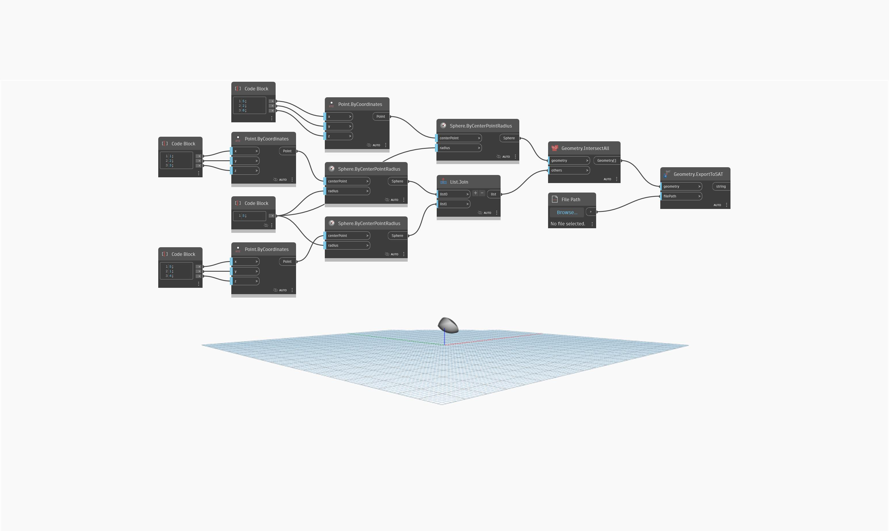

<!--- Autodesk.DesignScript.Geometry.Geometry.ExportToSAT(geometry, filePath) --->
<!--- JH36N5G6EIZEJ76U2VOWYIWXR6YQWP4IHRIMTPOZSNO2AH62Y7TA --->
## Podrobnosti
Uzel `Geometry.ExportToSAT` exportuje geometrii z aplikace Dynamo do souboru typu SAT. Tento uzel je bez jednotek; chcete-li určit jednotku, použijte uzel `ExportToSAT`.

V následujícím příkladu je možné objekt PolySurface z průsečíku tří koulí exportovat do souboru SAT, jakmile vyberete cestu k souboru.

___
## Vzorový soubor

