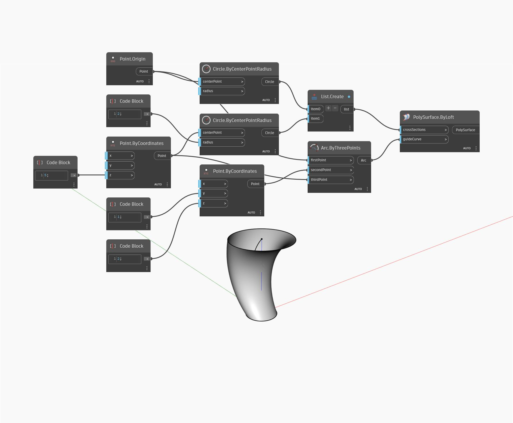

<!--- Autodesk.DesignScript.Geometry.PolySurface.ByLoft(crossSections, guideCurve) --->
<!--- KMSTMOWKW27MXHCUOIX46TZTXOOZLNUKTB4PHKIEB7ZYDANXLSFQ --->
## Podrobnosti
Uzel ByLoft (crossSections, guideCurve) vrátí nový objekt PolySurface šablonováním mezi křivkami v seznamu a vodicí křivkou. V níže uvedeném příkladu je vrácen nový objekt PolySurface šablonováním mezi dvěma kružnicemi. Vrácený objekt PolySurface je zkreslený upravováním oblouku ve vstupu guideCurve.
___
## Vzorový soubor

