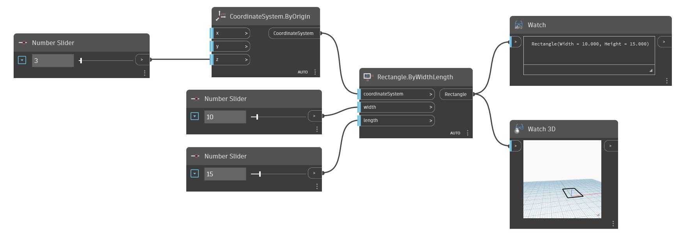

<!--- Autodesk.DesignScript.Geometry.Rectangle.ByWidthLength(coordinateSystem, width, length) --->
<!--- LMVGRWYVOONMRPCSD3NCYVD776V33DFYWXC2F5S3KREHPOX5A2FA --->
## Podrobnosti
Uzel Rectangle.ByWidthLength vytvoří obdélník v daném souřadnicovém systému s danou šířkou a délkou. Pokud se vstupní souřadnicový systém posune, obdélník se také posune podle souřadnicového systému.
___
## Vzorový soubor

