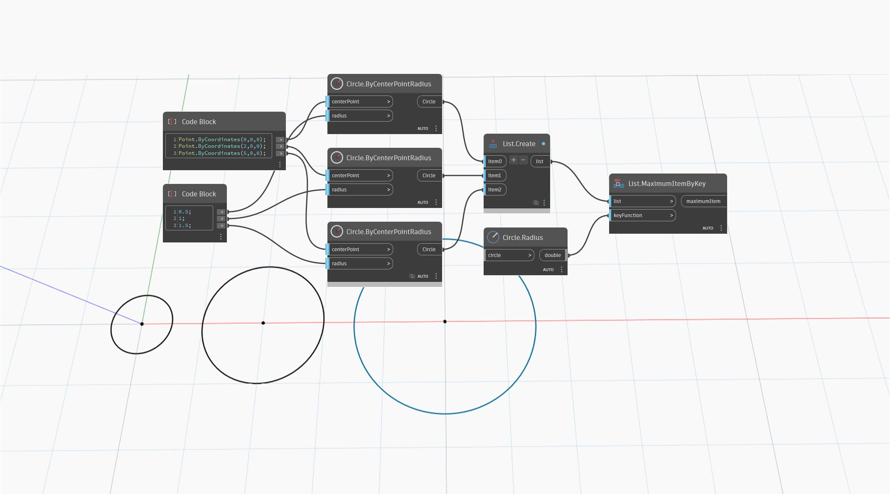

## Podrobnosti
Uzel `List.MaximumItemByKey` vrací největší položku v seznamu podle klíčové funkce.

V následujícím příkladu je porovnána řada tří kružnic se zvětšujícími se poloměry, přičemž poloměr se použije jako klíč. Vrácena je kružnice v bodě (5,0,0), protože má největší poloměr.
___
## Vzorový soubor

