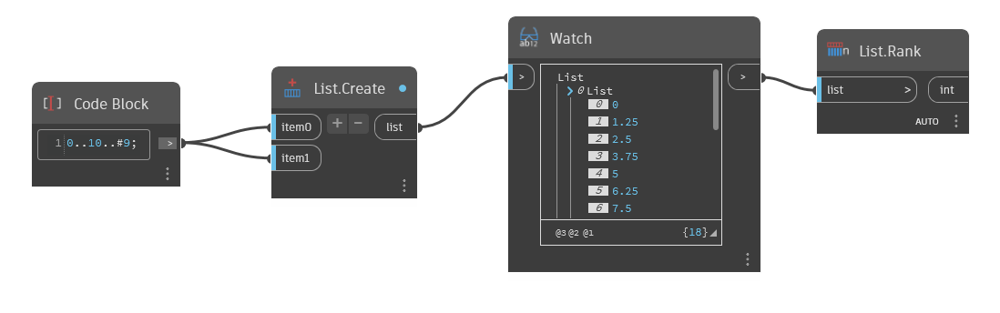

## In Depth
`List.Rank` counts how many levels are in a list.

In the example below, we use a Rank node to return the number of levels on a list. The list has 2 levels, so `List.Rank` returns 2.

___
## Example File

