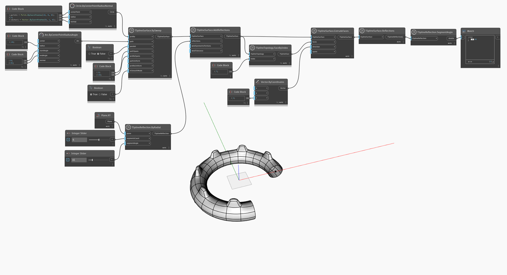

<!--- Autodesk.DesignScript.Geometry.TSpline.TSplineReflection.SegmentAngle --->
<!--- M2WJT5G52MFWUUNWUZWTY2TSRSRY6GVVIAT4LLVJUC2VVLHVGW7A --->
## In-Depth
Hodnota `TSplineReflection.SegmentAngle` vrací úhel mezi každým párem segmentů radiálního odrazu. Pokud je typ objektu TSplineReflection nastaven na hodnotu Osový, uzel vrátí hodnotu 0.

V níže uvedeném příkladu je vytvořen povrch T-Spline s přidanými odrazy. Později v grafu je povrch dotazován uzlem `TSplineSurface.Reflections`. Výsledek (odraz) se poté použije jako vstup pro uzel `TSplineReflection.SegmentAngle`, který vrací úhel mezi segmenty radiálního odrazu.

## Vzorový soubor

