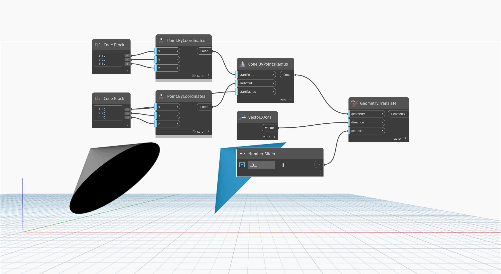

<!--- Autodesk.DesignScript.Geometry.Geometry.Translate(direction, distance) --->
<!--- M4QGSXM2OJC62OCBK7RPJB4QI2KY3B3N3OAB4I4GHJNAOMXLKKRA --->
## Podrobnosti
Uzel `Geometry.Translate (direction, distance)` přesune vstupní geometrii zadaným směrem vektoru. Vstup `distance` určuje vzdálenost posunu.

V následujícím příkladu je kužel přesunut podél osy X. Jeho vzdálenost od původního kužele je řízena posuvníkem.

V následujícím příkladu je kvádr převeden na definici tělesa. Chcete-li použít řetězcovou reprezentaci definice tělesa v jiném grafu, zkopírujte obsah uzlu Watch.

___
## Vzorový soubor

