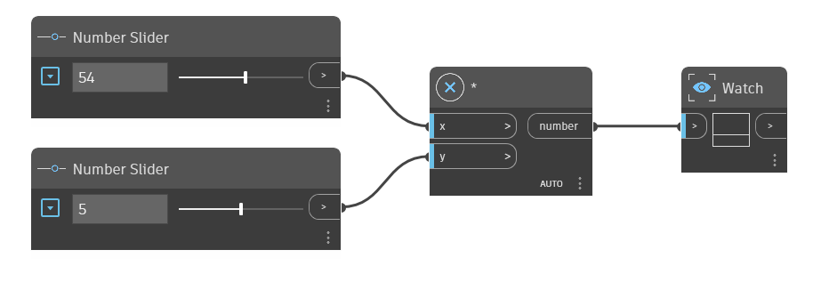

## Podrobnosti
Uzel `*' je operátor násobení. Vrátí součin dvou vstupních čísel. V níže uvedeném příkladu je uzel `*' použit k vynásobení x krát y. K řízení vstupů operátoru `*' použijeme dva posuvníky čísel.
___
## Vzorový soubor

