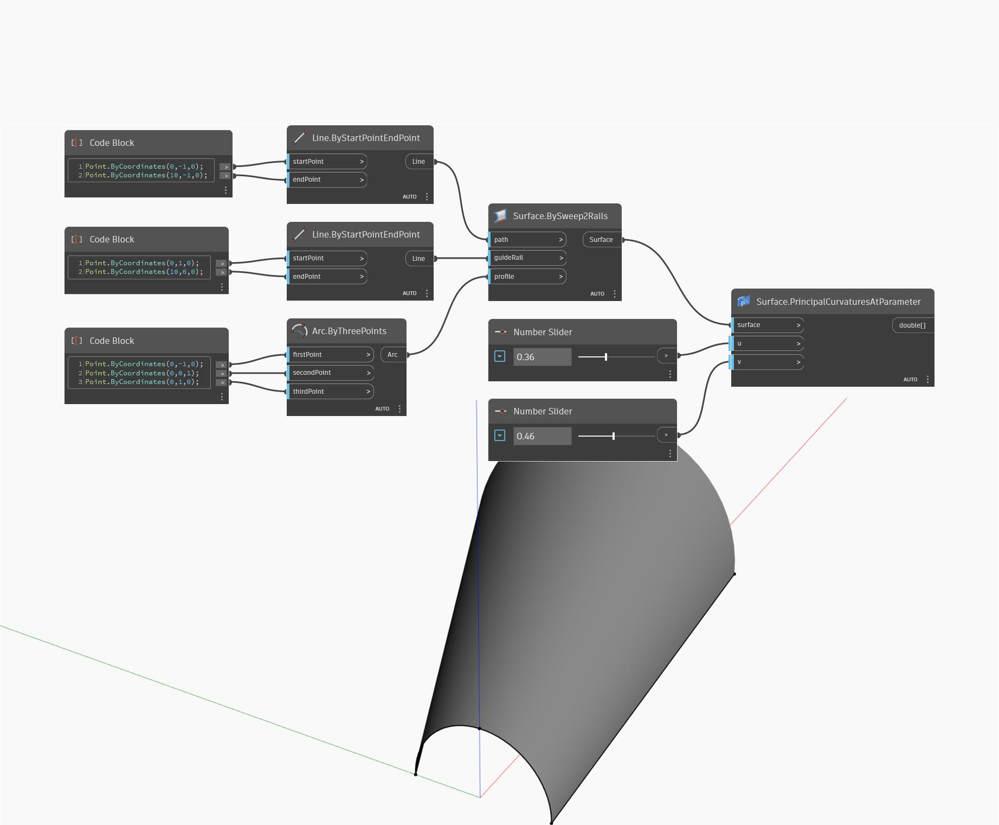

<!--- Autodesk.DesignScript.Geometry.Surface.PrincipalCurvaturesAtParameter --->
<!--- NQ2UYUO5AOUOJKI6R3LJ6WF42LNGGMNBYD567DQ737Q2ZM3FP6IQ --->
## Podrobnosti
Uzel Principal Curvatures at Parameter používá vstupní parametry U a V a vrací zakřivení ve směrech U a V. Tento uzel vrací seznam dvou čísel, přičemž první je zakřivení ve směru U a druhé je zakřivení ve směru V. V níže uvedeném příkladu nejprve vytvoříme povrch pomocí uzlu BySweep2Rails. Poté pomocí dvou číselných posuvníků určujících parametry U a V a pomocí uzlu PrincipalCurvaturesAtParameter najdeme zakřivení.
___
## Vzorový soubor

