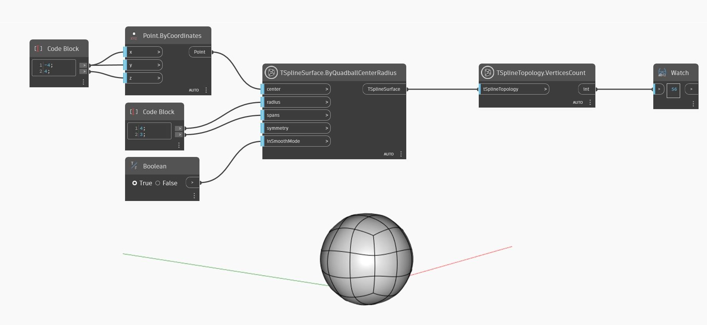

<!--- Autodesk.DesignScript.Geometry.TSpline.TSplineTopology.VerticesCount --->
<!--- OUBDJTXQVGIEZZTOCO3QDFCDT73JUQD54U6YYFBJZUKZDZEYPYKA --->
## Podrobnosti
V níže uvedeném příkladu je pomocí uzlu `TSplineTopology.VerticesCount` vrácen počet vrcholů povrchu čtyřúhelníkové koule T-Spline.
___
## Vzorový soubor

