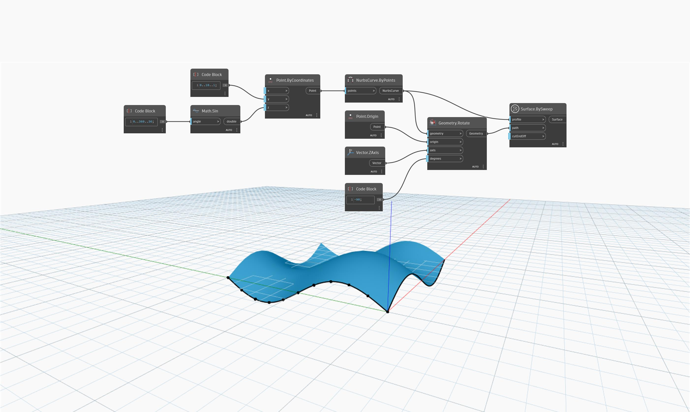

<!--- Autodesk.DesignScript.Geometry.Surface.BySweep(profile, path, cutEndOff) --->
<!--- PQ27ZE4XS2FHDBHXA6BY6FYFII5PDNG3ZXNQMB4GDZEPNQHUZH3A --->
## Podrobnosti
Uzel `Surface.BySweep (profile, path, cutEndOff)` vytvoří povrch tažením vstupní křivky podél zadané trajektorie. Vstup `cutEndOff` určuje, zda má být konec tažení vyříznut a nastaven tak, aby byl kolmý k trajektorii.

V následujícím příkladu použijeme sinusoidu ve směru Y jako křivku profilu. Otočíme tuto křivku o -90 stupňů kolem globální osy Z, aby ji bylo možné použít jako křivku trajektorie. Uzel Surface BySweep přesune křivku profilu podél křivky trajektorie, čímž vznikne povrch.

___
## Vzorový soubor

