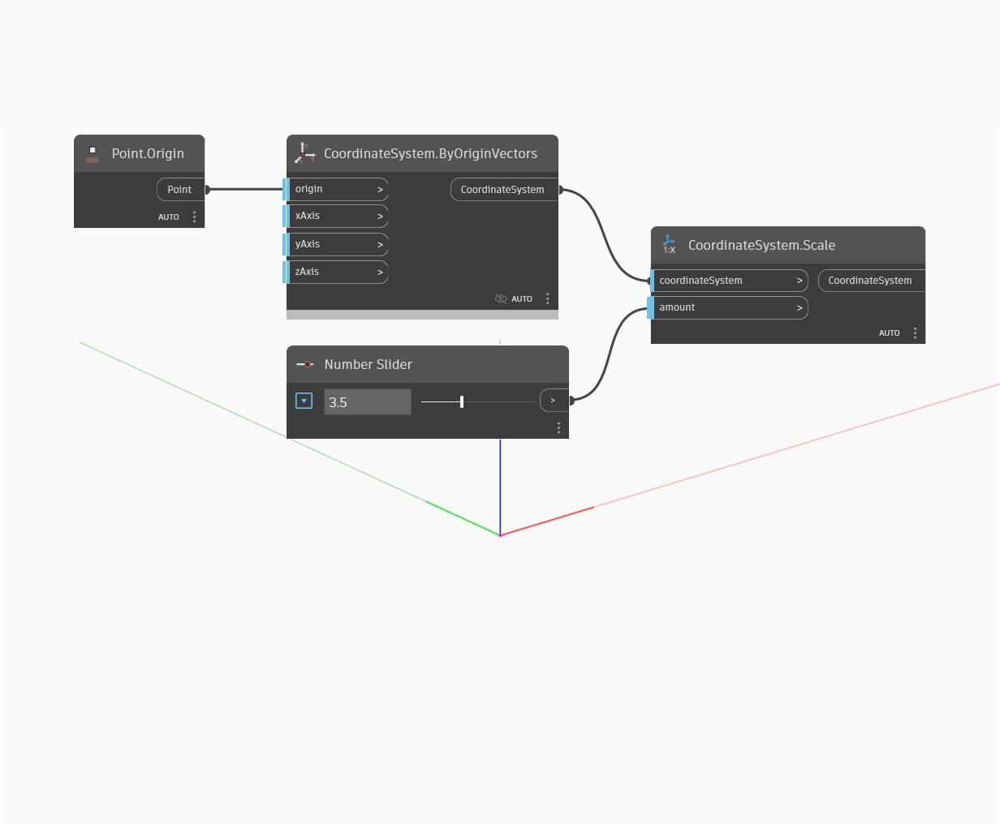

<!--- Autodesk.DesignScript.Geometry.CoordinateSystem.Scale(amount) --->
<!--- RDCTCOVW6BS5FRXZS3PR264DLYDXTBQLYNP6TATAOVQALTU6V3SA --->
## Podrobnosti
Změní měřítko souřadnicového systému rovnoměrně kolem počátku.
___
## Vzorový soubor

