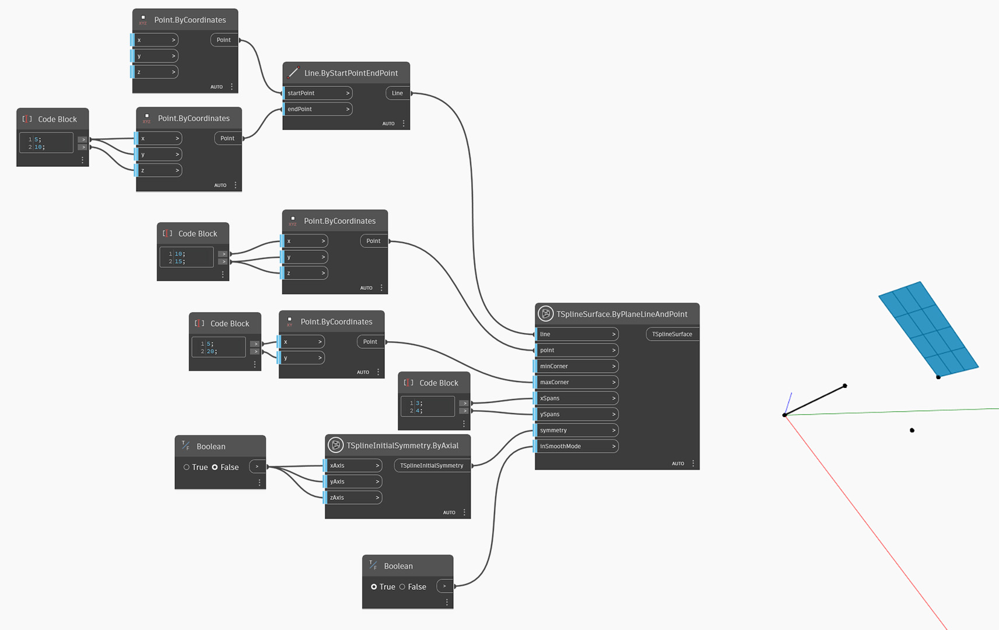

<!--- Autodesk.DesignScript.Geometry.TSpline.TSplineSurface.ByPlaneLineAndPoint --->
<!--- SFB4J46343LP6YKDRW2FPILSS6UXITLDXWQKYJRD6LWHQJY2IYOA --->
## In-Depth
Uzel `TSplineSurface.ByPlaneLineAndPoint` vygeneruje základní rovinný povrch T-Spline z úsečky a bodu. Výsledný povrch T-Spline je rovina. K vytvoření roviny T-spline uzel používá následující vstupy:
- `line` a `point`: vstup požadovaný k definování orientace a pozice roviny.
- `minCorner` and `maxCorner`: the corners of the plane, represented as Points with X and Y values (Z coordinates will be ignored). These corners represent the extents of the output T-Spline surface if it is translated onto the XY plane. The `minCorner` and `maxCorner` points do not have to coincide with the corner vertices in 3D. For example, when a `minCorner` is set to (0,0) and `maxCorner` is (5,10), the plane width and length will be 5 and 10 respectively.
- `xSpans` and `ySpans`: number of width and length spans/divisions of the plane
- `symmetry`: whether the geometry is symmetrical with respect to its X, Y and Z axes
- `inSmoothMode`: whether the resulting geometry will appear with smooth or box mode

V níže uvedeném příkladu je rovinný povrch T-Spline vytvořený pomocí vstupů úsečky a roviny. Velikost povrchu je řízena dvěma body, které se použijí jako vstupy `minCorner` a `maxCorner`.

## Vzorový soubor

