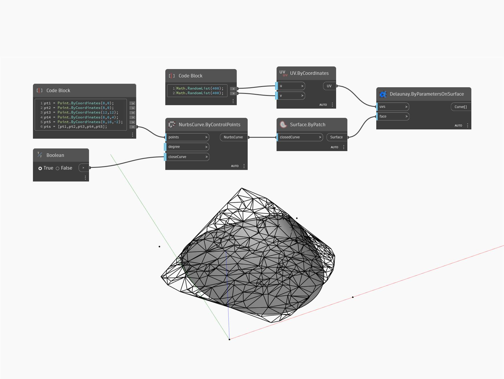

## Podrobnosti
Uzel `Delaunay.ByParametersOnSurface` vrací Delaunayovu triangulaci vstupního povrchu.

V následujícím příkladu je vrácena Delaunayova triangulace objektu NurbsSurface s počtem UV 400. Zvýšením počtu UV vytvoříte lepší aproximaci základního povrchu, ale s více trojúhelníky.

___
## Vzorový soubor

