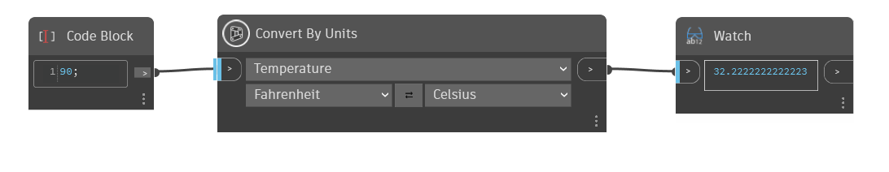

## Podrobnosti
Uzel `Convert By Units` převede vstupní hodnotu dané jednotky na odpovídající jednotku v jiném systému jednotek. Dostupné možnosti závisí na tom, jaký typ jednotky je vybrán v prvním rozevíracím seznamu. Pomocí tlačítek se šipkami přesuňte jednotky zleva doprava.

V příkladu pomocí funkce „Převést podle jednotek“ převedeme hodnotu ze stupňů Fahrenheita na stupně Celsia. Nejprve vybereme možnost Teplota v prvním rozevíracím seznamu, což ve dvou níže uvedených rozevíracích seznamech zobrazí pouze možnosti související s teplotou.
___
## Vzorový soubor

