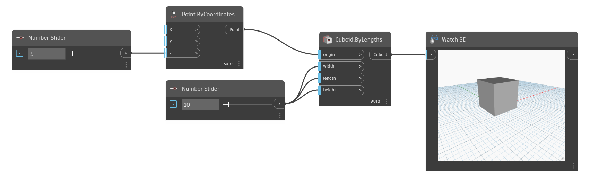

<!--- Autodesk.DesignScript.Geometry.Cuboid.ByLengths(origin, width, length, height) --->
<!--- VK63GH4YGTA23CXGPUEJO47L6TRGFRG7QY64LCFRO6C5G6UFK4PA --->
## Podrobnosti
Tento uzel Cuboid By Lengths umožňuje uživateli zadat bod počátku středu kvádru a také délku, šířku a výšku kvádru.
___
## Vzorový soubor

