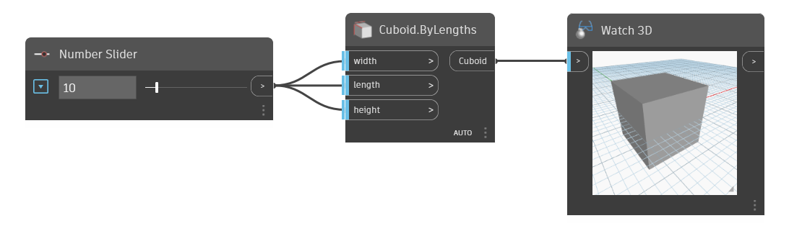

<!--- Autodesk.DesignScript.Geometry.Cuboid.ByLengths(width, length, height) --->
<!--- VKEUCM7XUAJICNIO5W65KAFEAZH4TUWVV7BPRMZSI5H5TPFZESTA --->
## Podrobnosti
Uzel Cuboid By Lengths vytvoří kvádr se vstupní šířkou, délkou a výškou, který je vystředěn na globální počátek (0,0,0). V příkladu se k zadání délky, šířky a výšky použije číselný posuvník.
___
## Vzorový soubor

