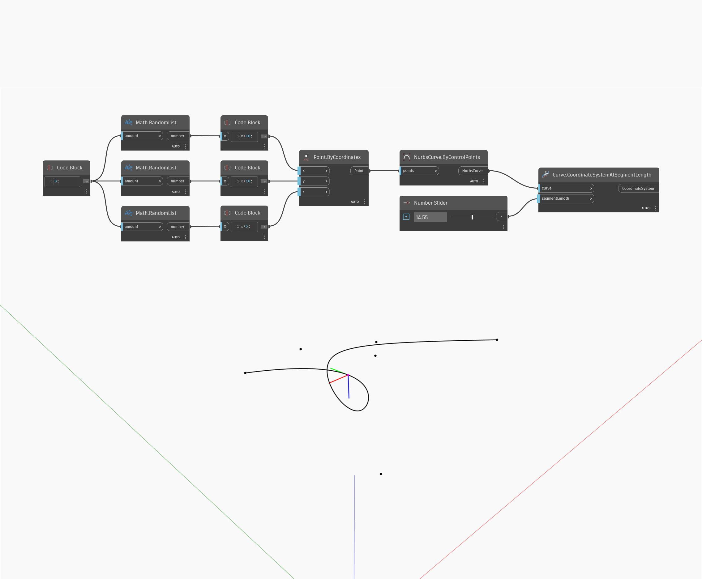

<!--- Autodesk.DesignScript.Geometry.Curve.CoordinateSystemAtSegmentLength --->
<!--- ZNPLCTHUSPIP3EMDAM4IGJTCBFMOVDXMVS2J4XSXYSX3WEWBWS5Q --->
## Podrobnosti
Uzel Coordinate System At Segment Length vrátí souřadnicový systém zarovnaný se vstupní křivkou v určené délce křivky, měřeno od počátečního bodu křivky. Výsledný souřadnicový systém bude mít osu X ve směru normály křivky a osu Y ve směru tečny křivky v určené délce. V níže uvedeném příkladu nejprve vytvoříme křivku Nurbs pomocí uzlu ByControlPoints, přičemž jako vstup se použije sada náhodně generovaných bodů. Číselný posuvník slouží k řízení vstupu délky segmentu pro uzel CoordinateSystemAtParameter. Pokud je určená délka větší než délka křivky, tento uzel vrátí souřadnicový systém v koncovém bodu křivky.
___
## Vzorový soubor

