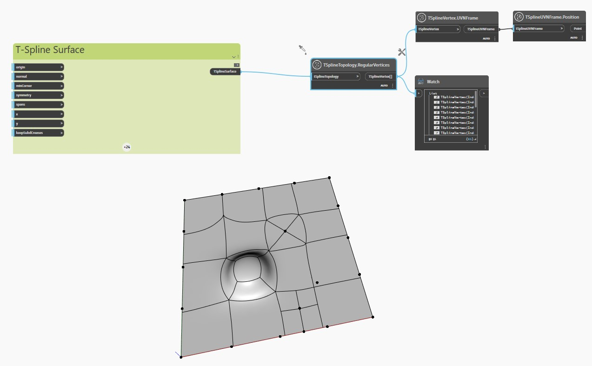

<!--- Autodesk.DesignScript.Geometry.TSpline.TSplineTopology.RegularVertices --->
<!--- 3FD66JH7OUVHRJOXDSO6GCVCZV63VG7PUZEMJMDZBM67ASM2XLRA --->
## Im Detail
Im folgenden Beispiel wird eine planare T-Spline-Oberfläche mit extrudierten, unterteilten und gezogenen Scheitelpunkten und Flächen mit dem Block `TSplineTopology.StarPointVertices` überprüft.

Die Blöcke `TSplineVertex.UVNFrame` und `TSplineUVNFrame.Position` werden verwendet, um die regulären Scheitelpunkte der Oberfläche hervorzuheben.
___
## Beispieldatei

