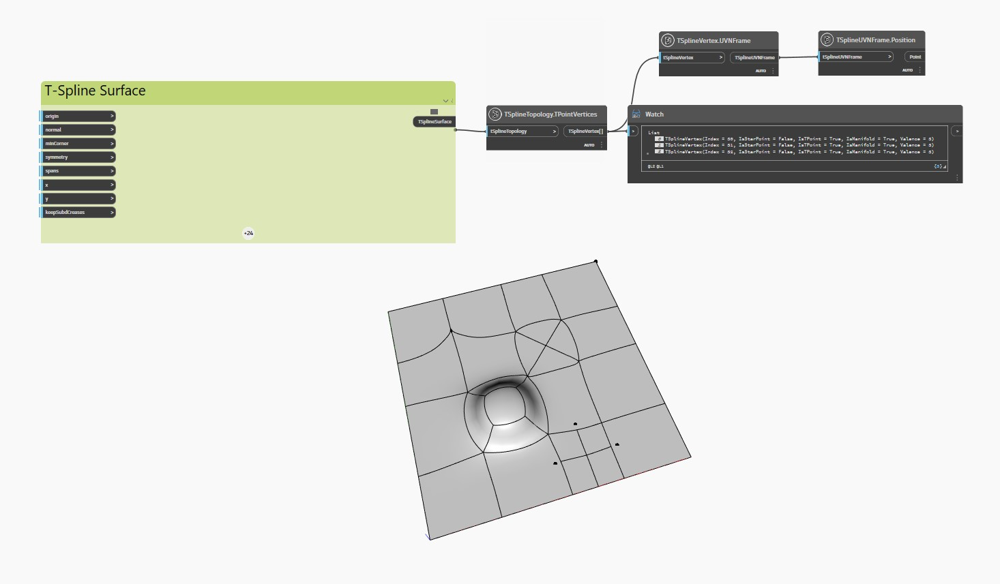

<!--- Autodesk.DesignScript.Geometry.TSpline.TSplineTopology.TPointVertices --->
<!--- 3JL6REDTXILJYKG3YL47NDNEA5YHNLEAYOO3JNMRUUBMWI4GDGHA --->
## Im Detail
Im folgenden Beispiel wird eine planare T-Spline-Oberfläche mit extrudierten, unterteilten und gezogenen Scheitelpunkten und Flächen mit dem Block `TSplineTopology.TPointVertices` dahingehend überprüft, ob einer der Scheitelpunkte ein T-Punkt ist.

Die Blöcke `TSplineVertex.UVNFrame` und `TSplineUVNFrame.Position` werden verwendet, um die T-Punkte auf der Oberfläche hervorzuheben.

___
## Beispieldatei

