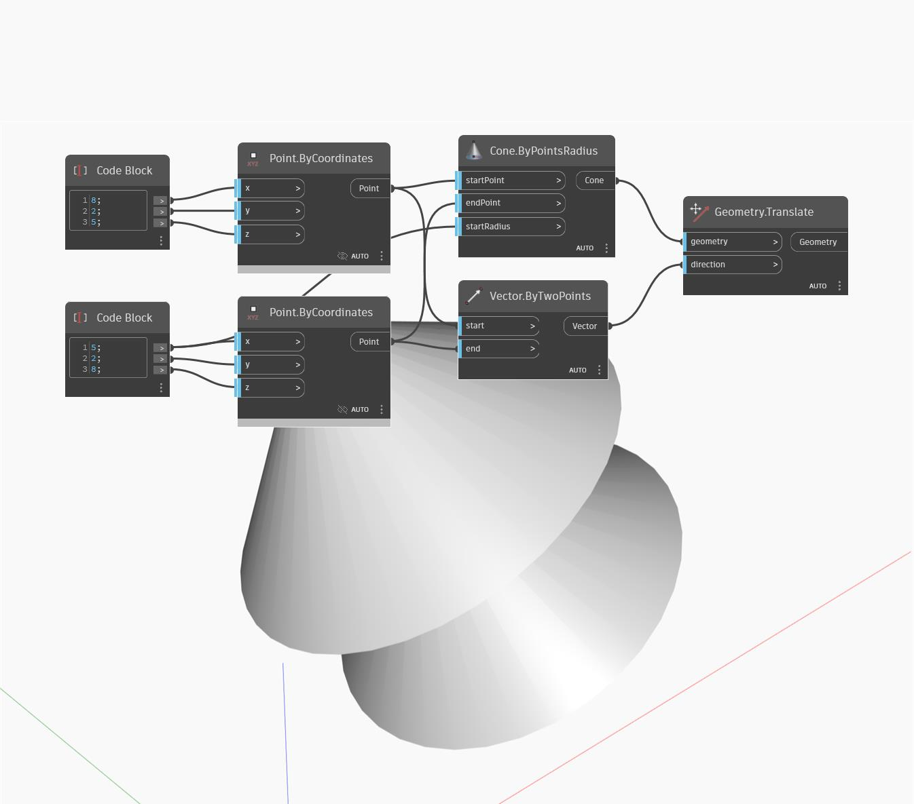

<!--- Autodesk.DesignScript.Geometry.Geometry.Translate(direction) --->
<!--- 4HVWIMWUUU4ZQWQXKFRWMQ5JABJVFMYBXFJZTHB2CQKCRQQ2FDVQ --->
## Im Detail
Verschiebt Geometrie um die Länge des Vektors in die angegebene Richtung.
___
## Beispieldatei

