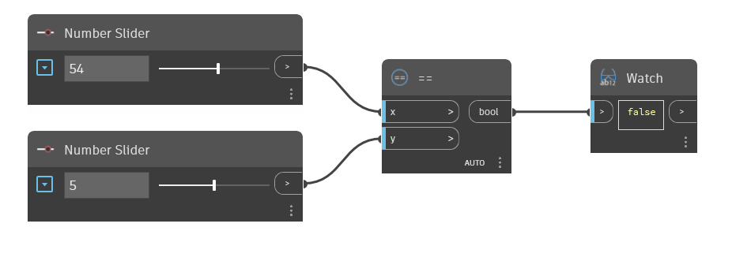

## Im Detail
Der Block `==` ist der Gleich-Operator. Wenn die Eingabe `x` gleich der Eingabe `y` ist, wird True zurückgegeben. Wenn die beiden Werte nicht gleich sind, wird False zurückgegeben. Dieser Block kann verwendet werden, um Zahlen und Nicht-Zahlen zu vergleichen, z. B. Zeichenfolgen, Revit-Objekte, Geometrie usw.

Im folgenden Beispiel wird der Block `==` verwendet, um zu ermitteln, ob die Eingaben x und y gleich sind. Die Eingaben für den Operator `==` werden mit zwei Zahlen-Schiebereglern gesteuert.
___
## Beispieldatei

