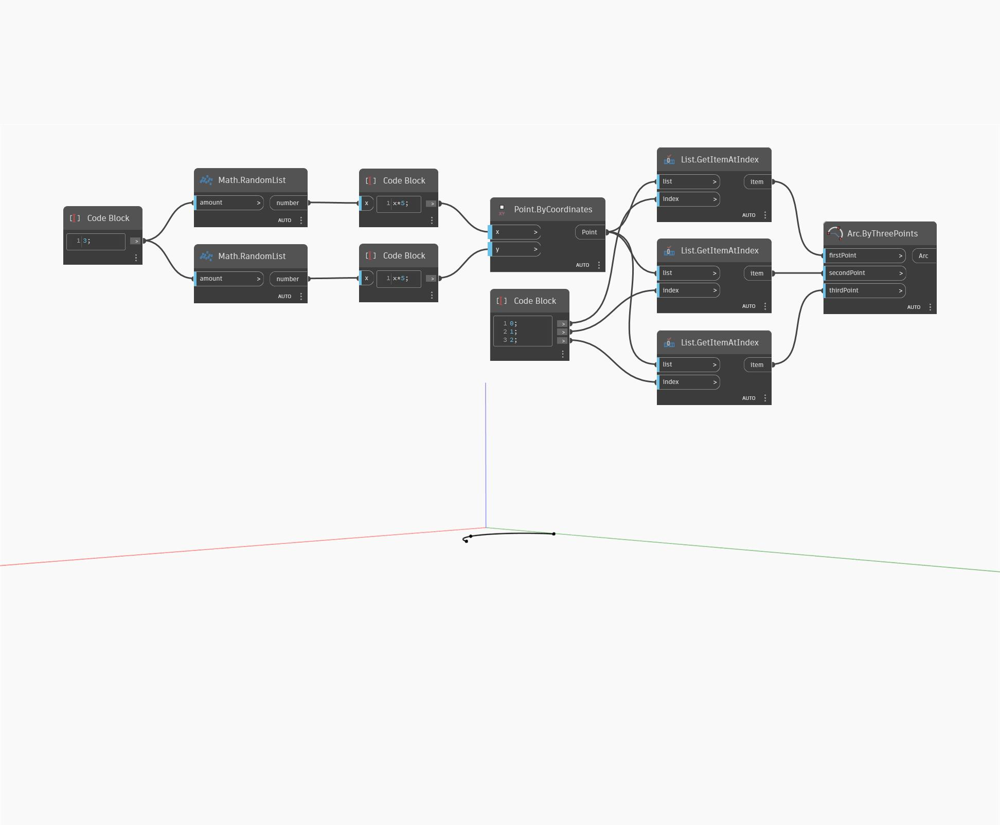

## Im Detail
`Arc.ByThreePoints` zeichnet einen Bogen anhand von drei Punkten, der durch den Anfangs- und Endpunkt sowie einen Punkt dazwischen definiert ist.

Im folgenden Beispiel wird ein Bogen anhand von drei zufällig erstellten Punkten gezeichnet.

___
## Beispieldatei

