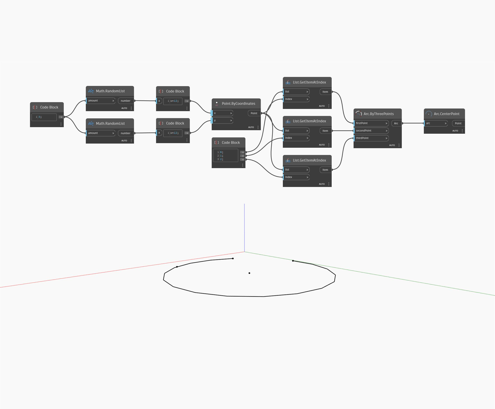

## Im Detail
`Arc.CenterPoint` gibt einen Punkt in der Mitte eines Bogens zurück; denselben Punkt wie der Mittelpunkt des entsprechenden Kreises.

Im folgenden Beispiel wird ein Bogen anhand von 3 zufällig generierten Punkten erstellt. Anschließend wird der Mittelpunkt mit einem `Arc.CenterPoint`-Block zurückgegeben.

___
## Beispieldatei

