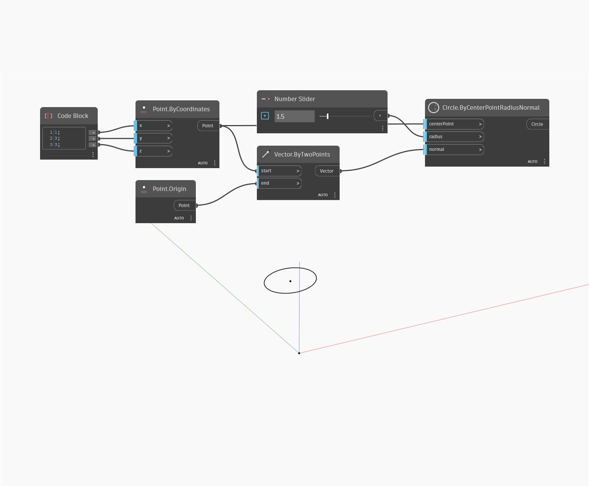

## Im Detail
Circle By Center Point Radius Normal erstellt einen Kreis an einem Punkt mit steuerbarem Radius und steuerbarer Normalen. In diesem Beispiel erstellen Sie einen Vektor vom Ursprungspunkt zum Punkt durch Koordinaten, um die Richtung des Kreises zu steuern.
___
## Beispieldatei

