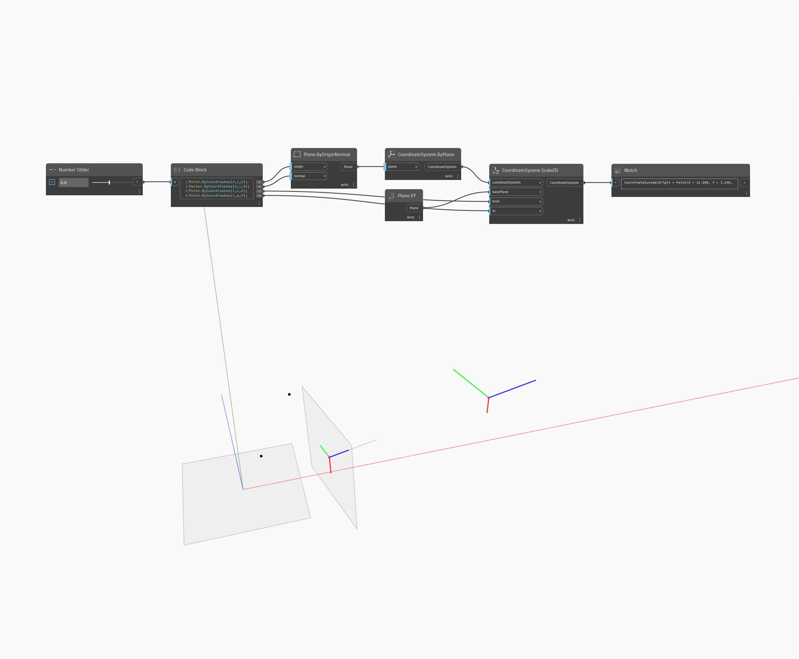

## Im Detail
Geometry Scale2D skaliert eine Geometrie von einer Basisebene und zwei Referenzpunkten aus in zwei Richtungen. In der Beispieldatei wird ein Kegel von seinem Endpunkt zu seinem Schwerpunkt in Bezug auf die YZ-Ebene skaliert.
___
## Beispieldatei

