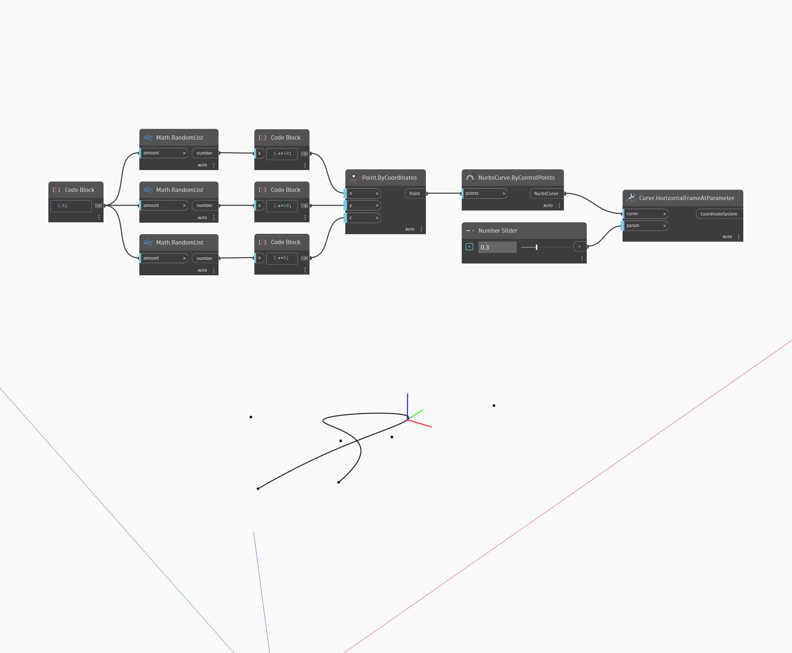

## Im Detail
Horizontal Frame At Parameter gibt ein Koordinatensystem zurück, das an der Eingabekurve am angegebenen Parameter ausgerichtet ist. Die Parametrisierung einer Kurve wird im Bereich von 0 bis 1 gemessen, wobei 0 den Start der Kurve und 1 das Ende der Kurve darstellt. Die Z-Achse des resultierenden Koordinatensystems liegt in Welt-Z-Richtung und die Y-Achse in Richtung der Kurventangente am angegebenen Parameter. Im folgenden Beispiel erstellen Sie zunächst eine NURBS-Kurve mit einem ByControlPoints-Block, wobei eine Reihe zufällig generierter Punkte als Eingabe verwendet wird. Ein auf den Bereich 0 bis 1 eingestellter Zahlen-Schieberegler wird verwendet, um die Parametereingabe für einen HorizontalFrameAtParameter-Block zu steuern.
___
## Beispieldatei

