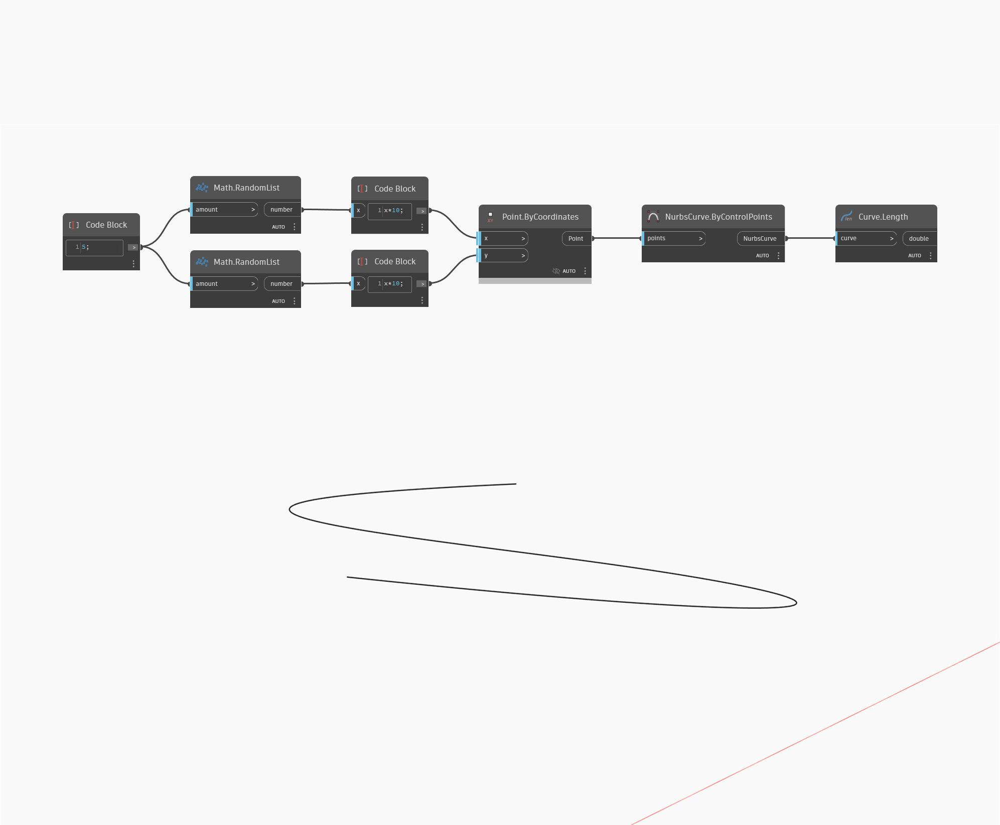

## Im Detail
`Curve.Length` gibt die Länge einer eingegebenen Kurve zurück.

Im folgenden Beispiel wird zunächst mithilfe eines `NurbsCurve.ByControlPoints`-Blocks ein NurbsCurve-Objekt mit einem Satz zufällig generierter Punkte als Eingabe erstellt. Wir können die Länge dieser Kurve ermitteln, indem wir einen `Curve.Length`-Block verwenden.

___
## Beispieldatei

