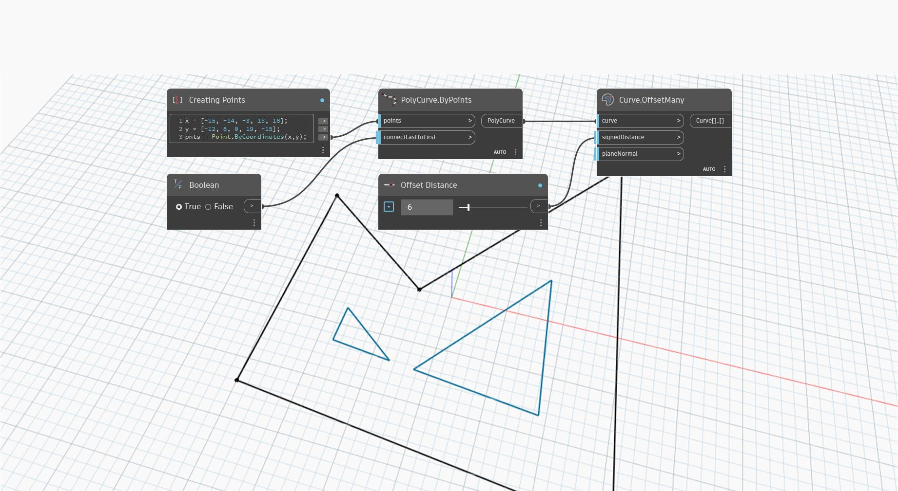

## Im Detail
`Curve.OffsetMany` erstellt eine oder mehrere Kurven, indem eine planare Kurve um den angegebenen Abstand in einer Ebene versetzt wird, die durch die Ebenennormale definiert ist. Wenn Lücken zwischen den versetzten Komponentenkurven vorhanden sind, werden diese durch Erweitern der Versatzkurven gefüllt.

Die `planeNormal`-Eingabe ist vorgabemäßig auf die Normale der Ebene festgelegt, die die Kurve enthält. Es kann jedoch eine explizite Normale parallel zur ursprünglichen Kurvennormalen angegeben werden, um die Richtung des Versatzes besser steuern zu können.

Wenn beispielsweise eine einheitliche Versatzrichtung für mehrere Kurven mit derselben Ebene erforderlich ist, kann die `planeNormal`-Eingabe verwendet werden, um einzelne Kurvennormalen zu überschreiben und zu erzwingen, dass alle Kurven in dieselbe Richtung versetzt werden. Durch Umkehren der Normalen wird die Richtung des Versatzes umgekehrt.

Im folgenden Beispiel wird eine Polykurve um einen negativen Versatzabstand versetzt, der in die entgegengesetzte Richtung des Kreuzprodukts zwischen der Kurventangente und dem Normalenvektor der Ebene angewendet wird.
___
## Beispieldatei

