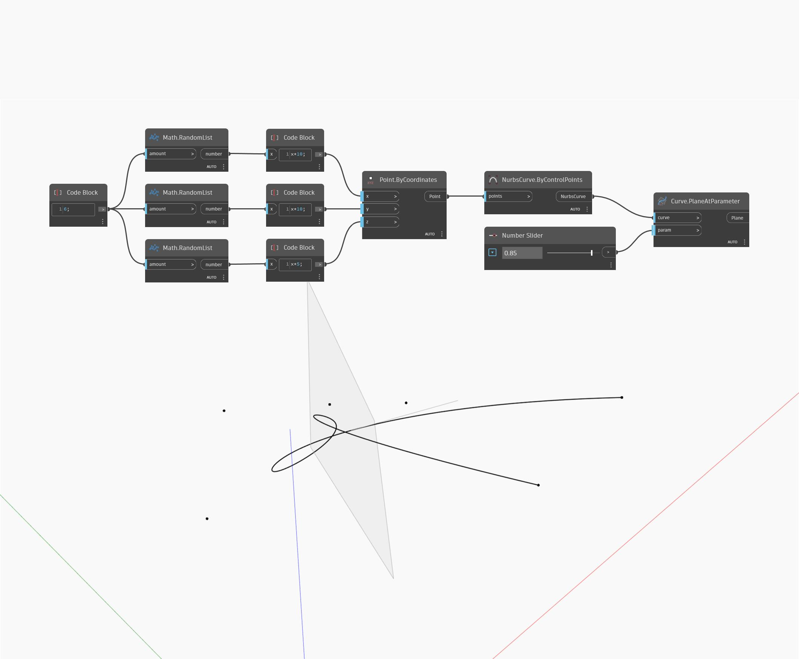

## Im Detail
Plane At Parameter gibt eine Ebene zurück, die an einer Kurve an einem angegebenen Parameter ausgerichtet ist. Der Normalenvektor der resultierenden Ebene entspricht der Tangente der Kurve. Die Parametrisierung einer Kurve wird im Bereich von 0 bis 1 gemessen, wobei 0 den Start der Kurve und 1 das Ende der Kurve darstellt. Im folgenden Beispiel erstellen Sie zunächst eine NURBS-Kurve mit einem ByControlPoints-Block, wobei eine Reihe zufällig generierter Punkte als Eingabe verwendet wird. Ein auf den Bereich 0 bis 1 eingestellter Zahlen-Schieberegler wird verwendet, um die Parametereingabe für einen PlaneAtParameter-Block zu steuern.
___
## Beispieldatei

