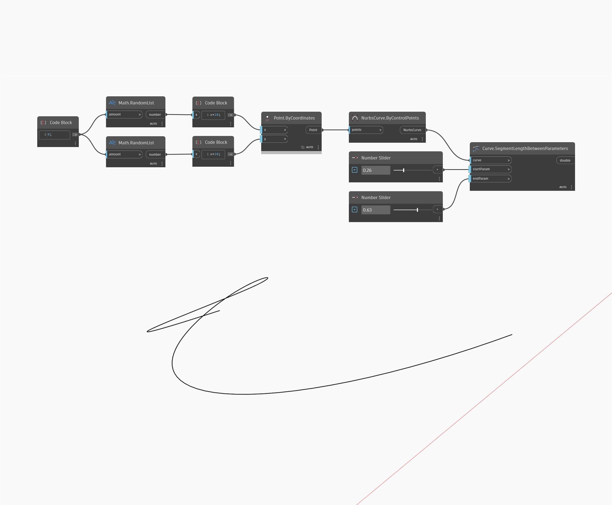

## Im Detail
Segment Length Between Parameters gibt die Länge einer Kurve zwischen dem eingegebenen Start- und Endparameter zurück, wobei der Wert 0 der Parameter am Anfang der Kurve und der Wert 1 der Parameter am Ende der Kurve ist. Im folgenden Beispiel verwenden Sie zwei Sätze zufälliger Zahlen, um eine Liste mit Punkten zu erstellen. Diese Punkte werden verwendet, um ein Nurbs Curve By Control Points-Objekt zu erstellen. Zwei auf den Bereich 0 bis 1 eingestellte Zahlen-Schieberegler werden für die Parametereingaben in einem SegmentLengthBetweenParameters-Block verwendet.
___
## Beispieldatei

