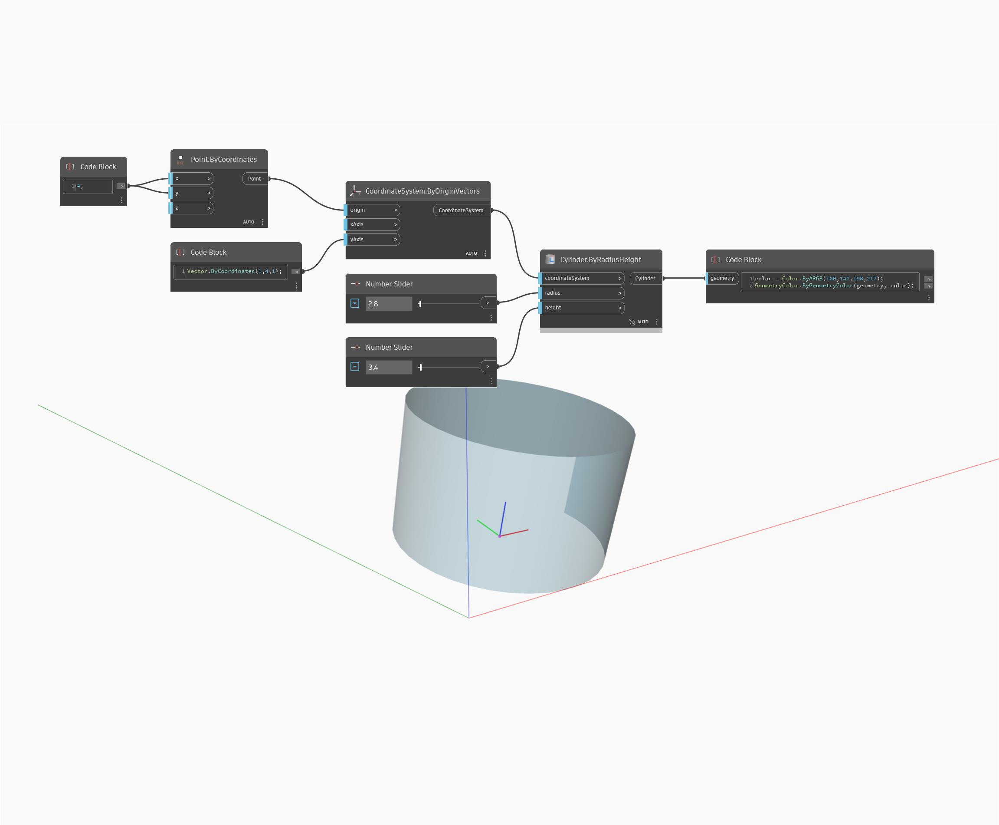

## Im Detail
ByRadiusHeight gibt einen Zylinder basierend auf einem CoordinateSystem zurück. Im folgenden Beispiel wird ein CoordinateSystem aus einem Ursprungspunkt und ein YAxis-Vektor verwendet, um einen gedrehten Zylinder zu erstellen.
___
## Beispieldatei

