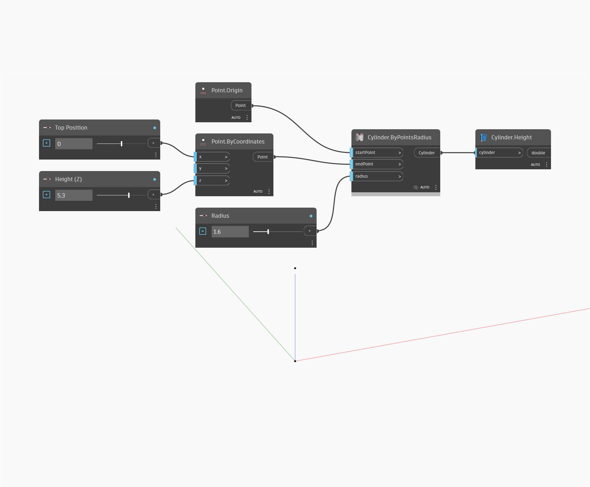

## Im Detail
`Cylinder.Height` gibt die Höhe des eingegebenen Zylinders zurück. Der Höhenwert ist relativ zum Ansichtsmaßstab.

Im folgenden Beispiel wird ein Zylinder durch den Start- und Endpunkt sowie den Radius generiert. Anschließend wird die Höhe mithilfe eines `Cylinder.Height`-Blocks ermittelt.

___
## Beispieldatei

