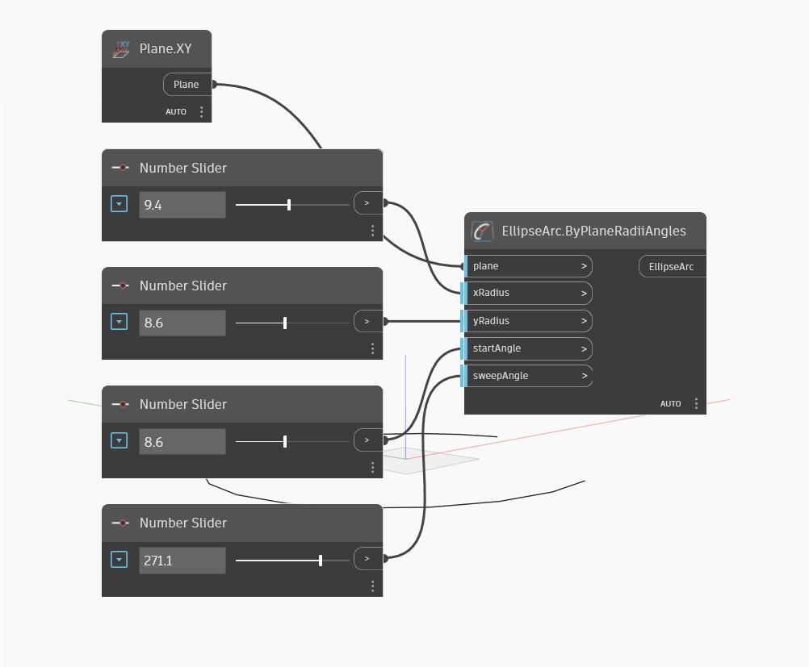

## Im Detail
Ellipse Arc by Plane Radii Angles erstellt einen Teil einer Ellipse. Die eingegebenen Werte für xRadius und yRadius geben die Radien der Ellipse entlang der X- und Y-Richtung der Eingabeebene an (die von Welt-X und -Y abweichen können). Die startAngle-Eingabe definiert den Startpunkt des Bogens entlang der Ellipse in Grad, beginnt gegen den Uhrzeigersinn von der X-Achse der Ebene und wird über eine Gesamtbogenlänge der sweepAngle-Eingabe fortgesetzt. Im folgenden Beispiel werden die XY-Ebene und eine Reihe von Zahlen-Schiebereglern verwendet, um die anderen Eingabeparameter zu steuern.
___
## Beispieldatei

