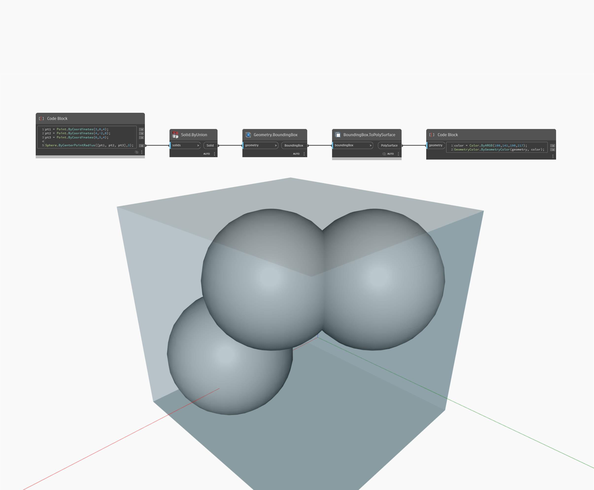

## Im Detail
`Geometry.BoundingBox` gibt einen Rahmen zurück, der durch die enthaltene Geometrie definiert ist. Ein BoundingBox-Objekt wird nicht angezeigt, kann jedoch mithilfe des Blocks `BoundingBox.ToPolySurface` als PolySurface-Objekt zurückgegeben werden.

Im folgenden Beispiel wird ein BoundingBox-Objekt für einen vereinigten Volumenkörper erstellt und als PolySurface-Objekt dargestellt.

___
## Beispieldatei

