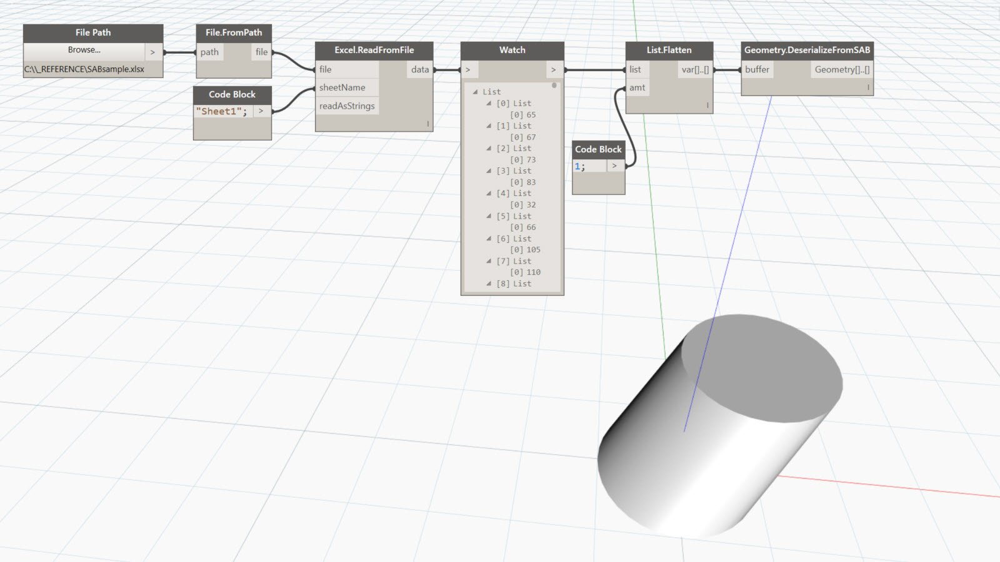

## Im Detail
DeserializeFromSAB gibt Geometrie aus SAB-Daten zurück. Im folgenden Beispiel werden SAB-Daten aus einer Datei gelesen und in einen schrägen Zylinder deserialisiert.
___
## Beispieldatei

