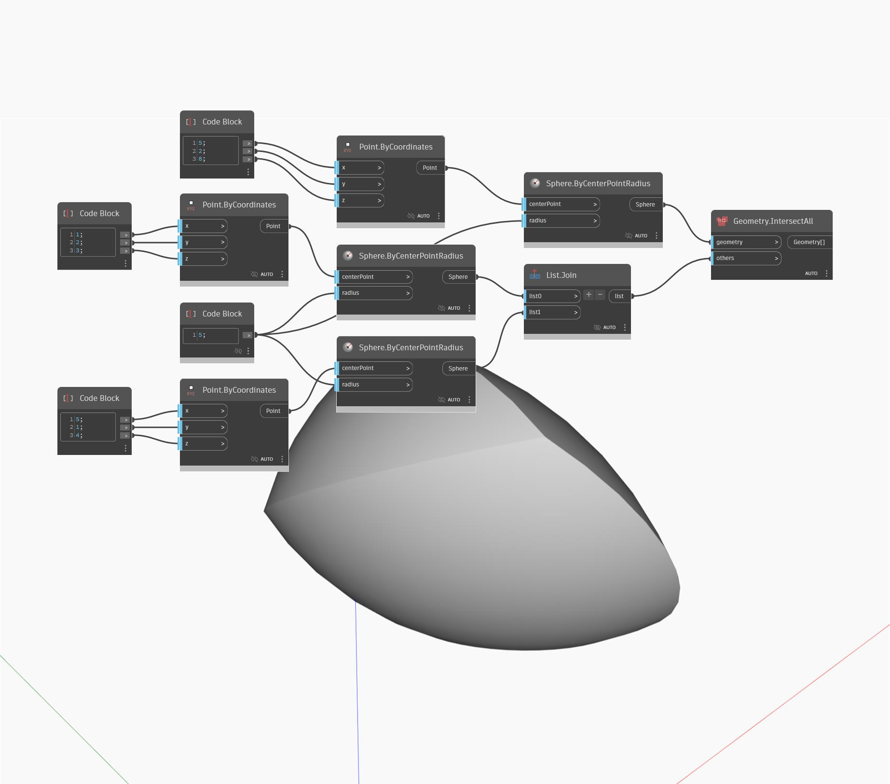

## Im Detail
Geometry IntersectAll sucht nach der Schnittpunktgeometrie, die von einer beliebigen Anzahl von Geometrieobjekten gemeinsam verwendet wird. In diesem Beispiel gibt der Schnittpunkt von drei Kugeln eine Polyfläche zurück, die auch als Volumenkörperschnittpunkt bezeichnet wird.
___
## Beispieldatei

