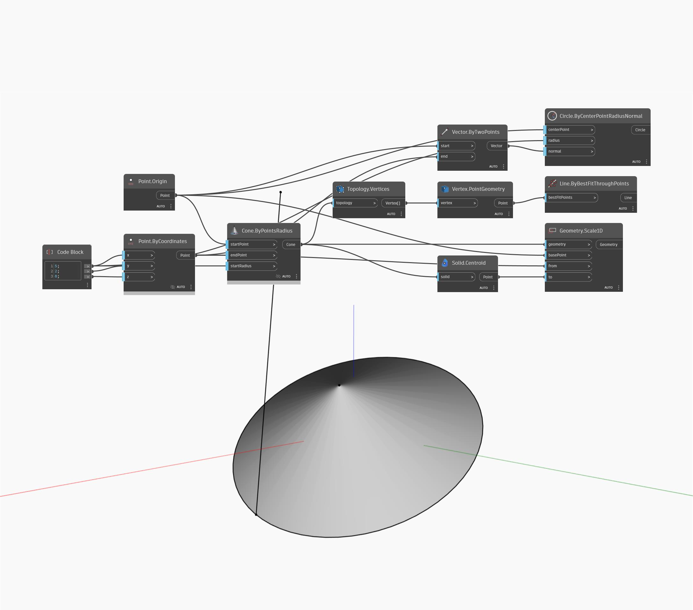

## Im Detail
Geometry Scale1D skaliert eine Geometrie von einem Basispunkt und zwei Referenzpunkten aus in eine Richtung. In der Beispieldatei wird ein Kegel vom Endpunkt zum Schwerpunkt in Bezug auf den Startpunkt des Kegels skaliert. Die ursprünglichen Kegelkanten werden als visuelle Referenz gezeichnet.
___
## Beispieldatei

