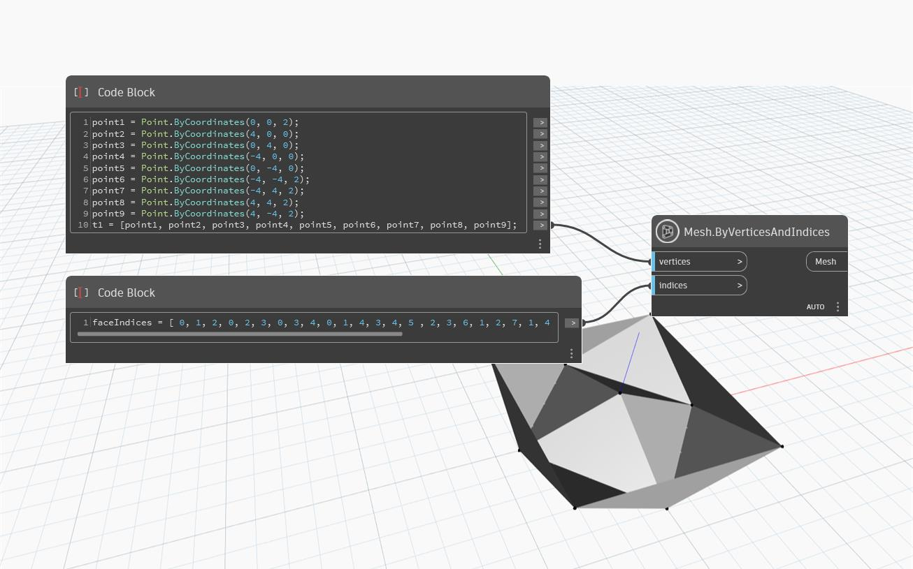

## Im Detail
`Mesh.ByVerticesIndices` verwendet eine Liste von `Points`, die die `vertices` der Netzdreiecke darstellen, und eine Liste von `indices`, die darstellen, wie das Netz zusammengefügt wird, und erstellt ein neues Netz. Die `vertices`-Eingabe muss eine flache Liste eindeutiger Scheitelpunkte im Netz sein. Die Eingabe für `indices` muss eine flache Liste von Ganzzahlen sein. Jeder Satz von drei Ganzzahlen kennzeichnet ein Dreieck im Netz. Die Ganzzahlen geben den Index des Scheitelpunkts in der Scheitelpunktliste an. Die Indizes-Eingabe muss 0-indiziert sein, wobei der erste Punkt der Scheitelpunktliste den Index 0 aufweisen sollte.

Im folgenden Beispiel wird ein `Mesh.ByVerticesIndices`-Block verwendet, um ein Netz mithilfe einer Liste von neun `vertices` und einer Liste von 36 `indices` zu erstellen, wobei die Scheitelpunktkombination für jedes der 12 Dreiecke des Netzes angegeben wird.

## Beispieldatei

