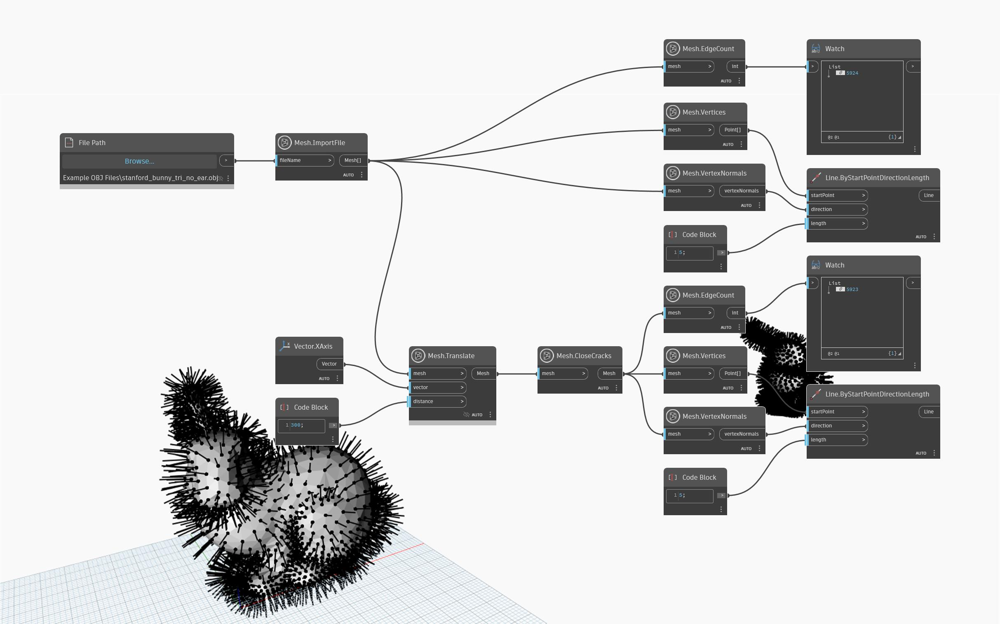

## Im Detail
`Mesh.CloseCracks` schließt Risse in einem Netz durch Entfernen interner Begrenzungen eines Netzobjekts. Interne Begrenzungen können auf natürliche Weise als Ergebnis von Netzmodellierungsoperationen entstehen. Dreiecke können bei dieser Operation gelöscht werden, wenn degenerierte Kanten entfernt werden. Im folgenden Beispiel wird `Mesh.CloseCracks` für ein importiertes Netz verwendet. `Mesh.VertexNormals` wird verwendet, um die überlappenden Scheitelpunkte zu visualisieren. Nachdem das ursprüngliche Netz `Mesh.CloseCracks` durchlaufen hat, ist die Anzahl der Kanten reduziert. Dies wird auch durch den Vergleich der Kantenanzahl mithilfe eines `Mesh.EdgeCount`-Blocks deutlich.

## Beispieldatei

