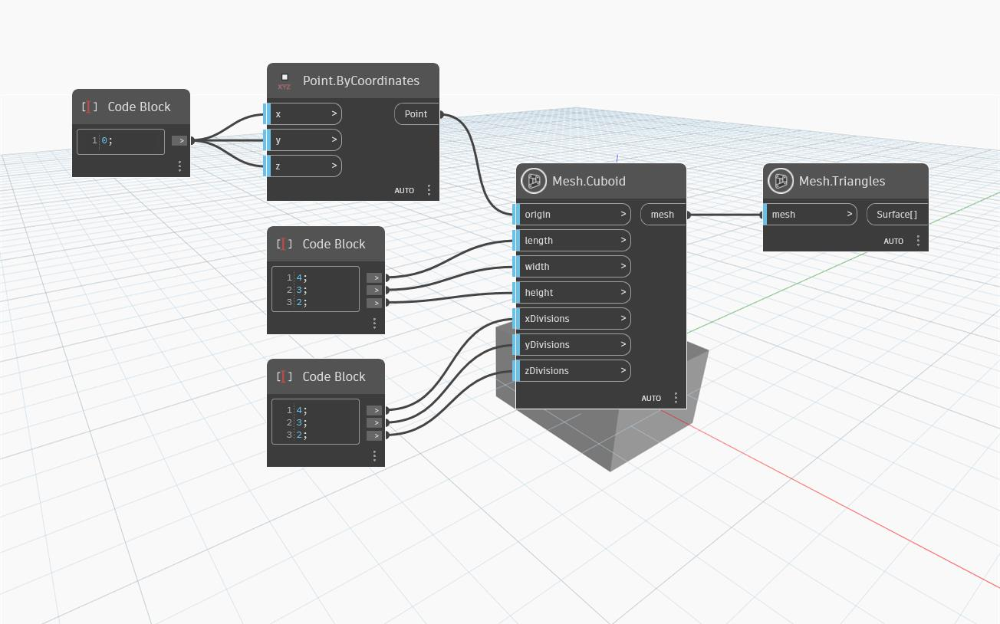

## Im Detail
`Mesh.Cuboid` erstellt einen am Eingabepunkt zentrierten Netzquader mit einer bestimmten `width`, `length` und  `height` und einer bestimmten Anzahl von Unterteilungen entlang der X-, Y- und Z-Richtung. Wenn die Anzahl der Unterteilungen nicht explizit angegeben wird oder eine der Eingaben für `xDivisions`, `yDivisions` oder `zDivisions` gleich Null ist, wird der Vorgabewert von 5 Unterteilungen entlang aller Richtungen verwendet.
Im folgenden Beispiel wird mit dem `Mesh.Cuboid`-Block ein Quadernetz erstellt, und mit dem `Mesh.Triangles`-Block wird die Verteilung der Netzdreiecke visualisiert.

## Beispieldatei

