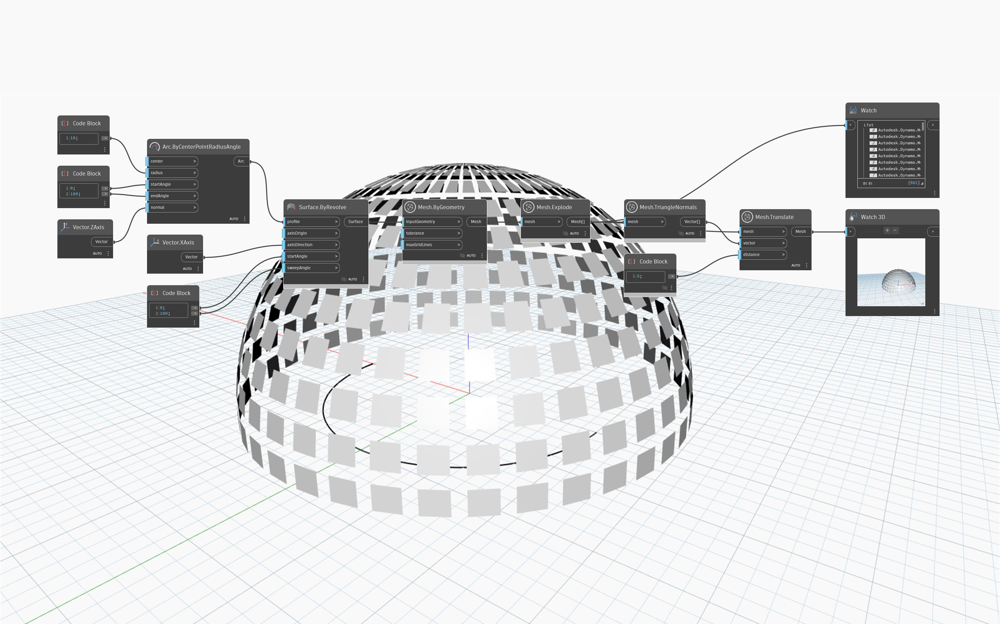

## Im Detail
Der `Mesh.Explode`-Block verwendet ein einzelnes Netz und gibt eine Liste mit Netzflächen als unabhängige Netze zurück.

Das folgende Beispiel zeigt eine Netzkuppel, die mit `Mesh.Explode` aufgelöst wird, gefolgt von einem Versatz jeder Fläche in Richtung der Flächennormalen. Dies wird mithilfe der Blöcke `Mesh.TriangleNormals` und `Mesh.Translate` erreicht. Obwohl die Netzflächen in diesem Beispiel wie Quader erscheinen, handelt es sich in Wirklichkeit um Dreiecke mit identischen Normalen.

## Beispieldatei

