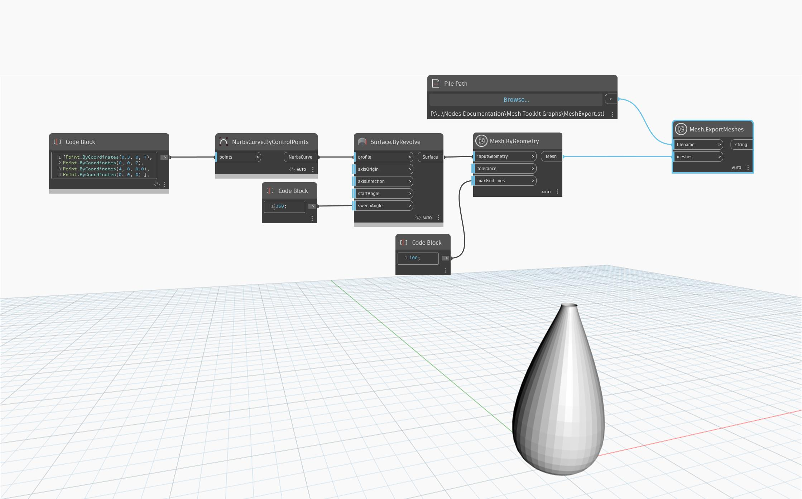

## Im Detail
`Mesh.ExportMeshes` exportiert das Netz in ein Dateiformat. Der zu exportierende Netztyp wird durch die Dateinamenerweiterung bestimmt. Beispielsweise wird ein Dateiname mit der Endung ".stl" wie im folgenden Beispiel im STL-Format exportiert.
Die folgenden Formate werden unterstützt:
- .mix - Meshmixer
- .obj - Wavefront OBJ
- .stl - STL-Format
- .dae - COLLADA
- .ply - Polygon File Format

## Beispieldatei

