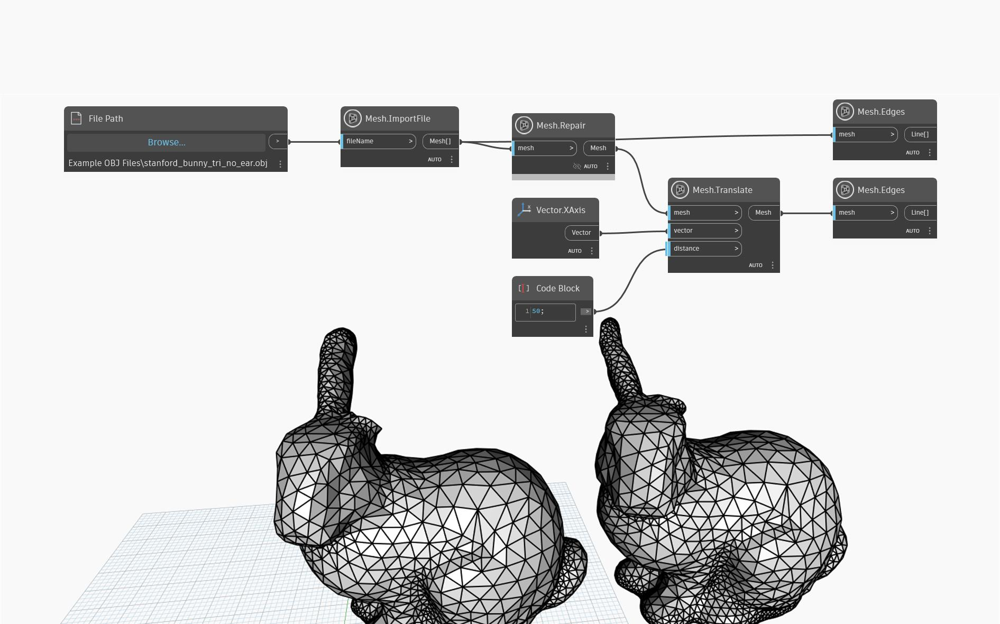

## Im Detail
Gibt ein neues Netz zurück, bei dem die folgenden Fehler behoben wurden:
- Kleine Komponenten: Wenn das Netz (im Verhältnis zur Gesamtnetzgröße) sehr kleine nicht verbundene Segmente enthält, werden diese verworfen.
- Löcher: Löcher im Netz werden aufgefüllt.
- Nicht mannigfaltige Bereiche: Wenn ein Scheitelpunkt mit mehr als zwei *Begrenzungskanten* oder eine Kante mit mehr als zwei Dreiecken verbunden ist, ist der Scheitelpunkt/die Kante nicht mannigfaltig. Das Mesh-Toolkit entfernt Geometrie, bis das Netz mannigfaltig ist.
Bei dieser Methode wird versucht, so viel wie möglich vom ursprünglichen Netz beizubehalten, im Gegensatz zu MakeWatertight, bei dem das Netz neu gesampelt wird.

Im folgenden Beispiel wird `Mesh.Repair` auf ein importiertes Netz angewendet, um das Loch um das Ohr des Hasen herum zu füllen.

## Beispieldatei

