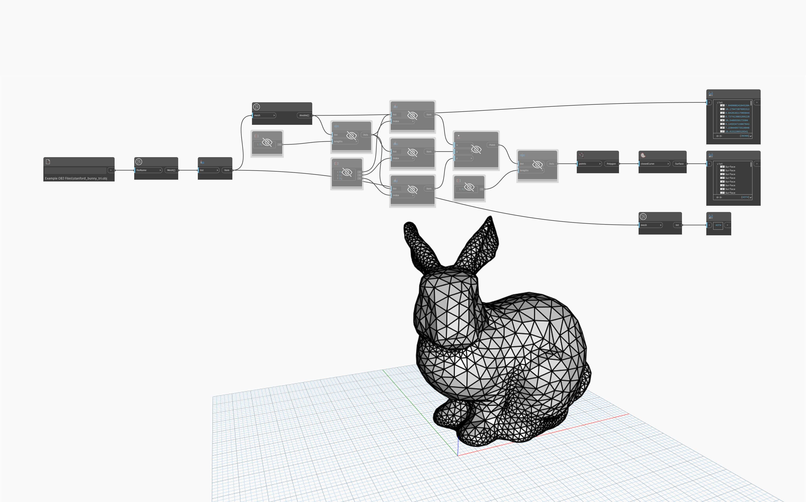

## Im Detail
`Mesh.TrianglesAsNineNumbers` bestimmt die X-, Y- und Z-Koordinaten der Scheitelpunkte, aus denen sich die einzelnen Dreiecke in einem bereitgestellten Netz zusammensetzen. Dies ergibt neun Zahlen pro Dreieck. Dieser Block kann zum Abfragen, Rekonstruieren oder Konvertieren des ursprünglichen Netzes nützlich sein.

Im folgenden Beispiel werden `File Path` und `Mesh.ImportFile` verwendet, um ein Netz zu importieren. Anschließend wird `Mesh.TrianglesAsNineNumbers` verwendet, um die Koordinaten der Scheitelpunkte jedes Dreiecks abzurufen. Diese Liste wird dann mithilfe von`List.Chop` in drei Listen unterteilt, wobei die Eingabe für `lengths` auf 3 gesetzt wird. `List.GetItemAtIndex` wird dann verwendet, um die X-, Y- und Z-Koordinaten abzurufen und die Scheitelpunkte mit `Point.ByCoordinates` neu zu erstellen. Die Liste der Punkte wird wieder in drei Abschnitte unterteilt (3 Punkte für jedes Dreieck) und als Eingabe für `Polygon.ByPoints` verwendet.

## Beispieldatei

