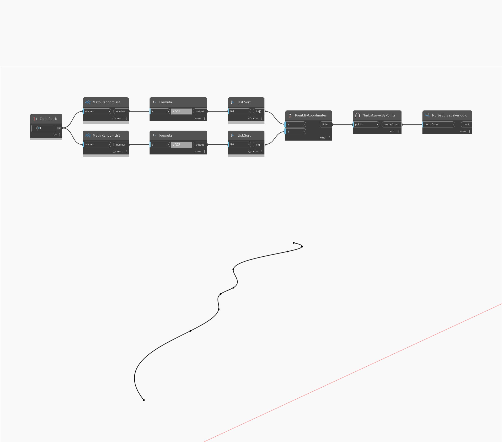

## Im Detail
IsPeriodic gibt den booleschen Wert True zurück, wenn die Kurve periodisch ist, und False, wenn die Kurve nicht periodisch ist. In diesem Beispiel erstellen Sie zunächst eine Reihe zufälliger Punkte, und anschließend erstellen Sie mit NurbsCurve ByPoints eine durch die Punkte interpolierte Kurve. Mithilfe von IsPeriodic können Sie bestimmen, ob die Kurve periodisch ist.
___
## Beispieldatei

