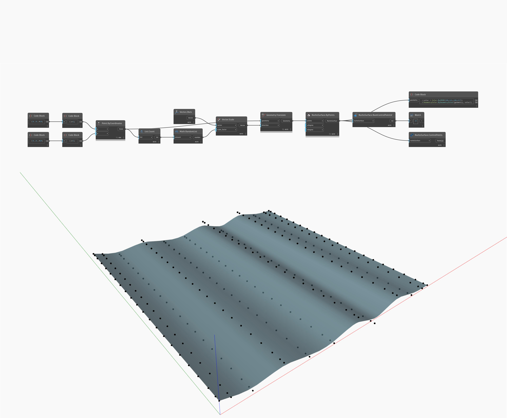

## Im Detail
NumControlPointsV zählt die Kontrollpunkte in V-Richtung einer NurbsSurface und gibt eine Ganzzahl zurück. Im folgenden Beispiel gibt NurbsSurface eine Ganzzahl von 12 für die V-Kontrollpunkte zurück. Die Kontrollpunkte werden als Punkte unter Verwendung von NurbsSurface.ControlPoints zurückgegeben.
___
## Beispieldatei

