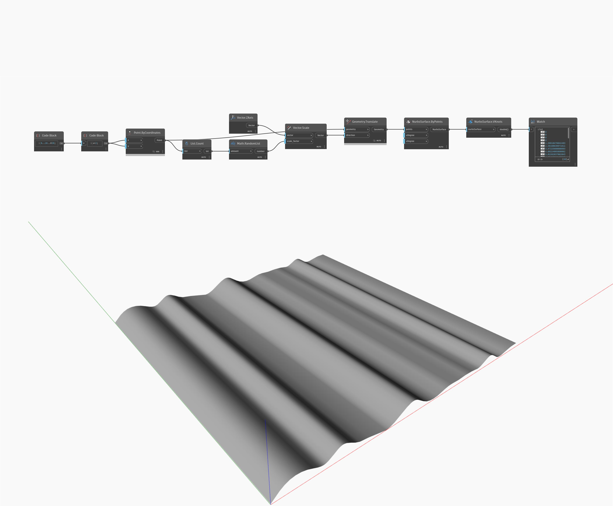

## Im Detail
VKnots gibt die Oberflächenknoten in V-Richtung einer NurbsSurface zurück. Im folgenden Beispiel werden die VKnots der NurbsSurface als Liste von double-Werten zurückgegeben.
___
## Beispieldatei

