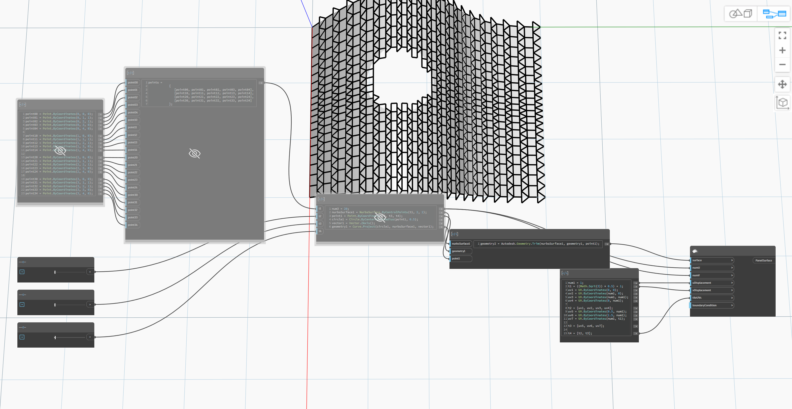

## Im Detail
Ordnet die Eingabeoberfläche in einem benutzerdefinierten Kachelmuster an. Die Kacheln sind Polygone im UV-Parameterraum. Sie können nicht konvex sein, dürfen sich jedoch nicht selbst schneiden. Es ist nicht zwingend erforderlich, dass sich die Kachelsätze an den Kanten berühren. Das Gruppenmuster wird durch das Verschieben von Kopien der Kacheln entlang der U- und V-Richtungen mithilfe der angegebenen Verschiebungen erzeugt. Die UV-Koordinaten der Scheitelpunkte jeder Kachel werden im tileUV-Argument bereitgestellt.
___
## Beispieldatei

