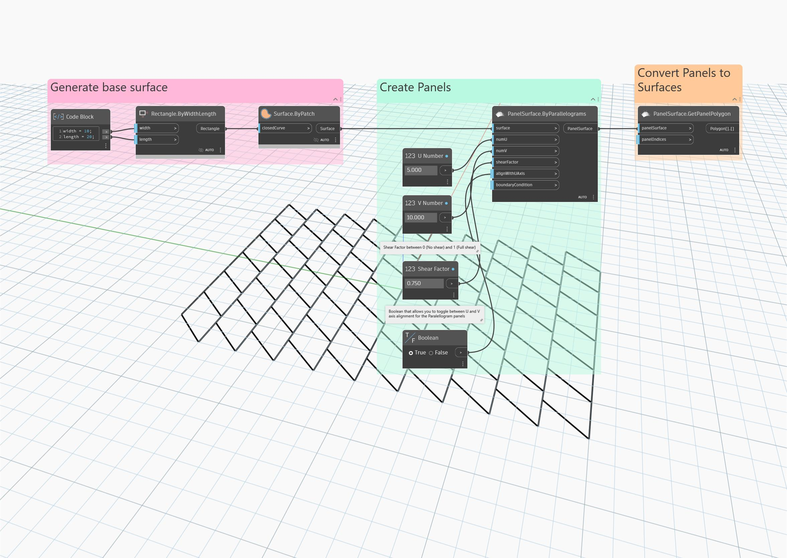

## Im Detail
Ordnet die Eingabeoberfläche in Parallelogrammen an, die vertikal und horizontal gekachelt sind. Jedes Parallelogramm ist ein Quadrat mit einer Scherung entlang der V- oder U-Achse, die durch die Eingabe alignWithUAxis und einen Scherfaktor bestimmt wird. Vorgabemäßig sind die Parallelogramme an der V-Achse ausgerichtet.
___
## Beispieldatei

